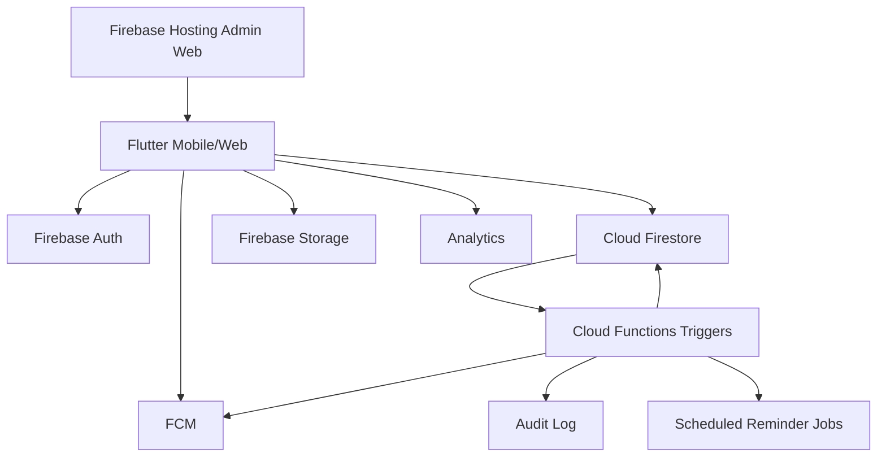

# Dernek Production Architecture

## 1. Ürün Vizyonu

Dernek, yardım organizasyonlarının mobilde hızlı veri girişi yapmasını, bağışçı ilişkilerini takip etmesini, ödeme sözlerini kaçırmamasını ve proje sonuçlarını güven veren bir iletişim akışıyla paylaşmasını sağlayan bir cross-platform sistemdir. Ana deneyim mobil uygulamadır; web arayüzü admin, raporlama ve büyük ekran dashboard için optimize edilir.

## 2. Mimari İlkeler

- **Clean Architecture:** Presentation, application/use-case, domain ve data katmanları ayrıdır.
- **Feature-first yapı:** Her modül kendi domain modeli, repository sözleşmesi, provider'ları ve ekranlarını taşır.
- **SOLID:** Repository arayüzleri domain katmanında, Firebase implementasyonları data katmanında tutulur.
- **Offline-first:** Firestore cache, optimistic UI, idempotent write commands ve `sync_queue` yaklaşımı kullanılır.
- **Security by design:** Client hiçbir admin kararını tek başına vermez; Firestore rules + custom claims + Cloud Functions beraber çalışır.
- **Mobile-first UX:** Bottom navigation, FAB, tek elle kullanım, swipe actions, hızlı WhatsApp ve hızlı bağış akışları.
- **Future-ready:** Tenant, ekip, görev, OCR, ödeme sağlayıcıları, WhatsApp Business API ve n8n entegrasyonu için genişleyebilir veri modeli.

## 3. Yüksek Seviye Sistem Mimarisi



## 4. Katmanlar

### Presentation

- Screens, route guards, widgets, empty/error/loading states.
- Riverpod `AsyncValue` ile standart loading/error yönetimi.
- Accessibility labels, minimum touch target, dark mode uyumu.

### Application

- Use-case servisleri: proje oluşturma, bağış kaydetme, ödeme sözü planlama, WhatsApp mesajı hazırlama.
- Validation, permission intent ve optimistic command üretimi.

### Domain

- Entity/value object: `Project`, `Donor`, `Donation`, `PaymentPromise`, `Reminder`, `WhatsAppTemplate`, `AuditLog`.
- Enumlar: role, project status, donation status, payment method, currency.

### Data

- Firebase repository implementasyonları.
- DTO/mapper katmanı.
- Pagination, query builders, aggregate cache ve transaction kullanımı.

## 5. Feature Modülleri

| Modül | Sorumluluk |
| --- | --- |
| Auth | Google Sign-In, session, RBAC, impersonation context |
| Dashboard | Aktif projeler, toplam bağış, geciken ödemeler, eksik telefonlar, kritik uyarılar |
| Projects | Proje CRUD, dosyalar, durum, tamamlanma checklist'i |
| Donors | Manuel/rehberden kişi ekleme, referans ilişkisi, eksik telefon uyarısı |
| Donations | Bağış kaydı, dekont, banka durumu, parçalı ödeme |
| Reminders | Günlük/haftalık/manuel hatırlatma, FCM tetikleme |
| WhatsApp | Tekil/toplu mesaj, şablon, placeholder render, deeplink |
| Reports | PDF/Excel export, finansal özet, bağışçı listesi |
| Admin | Kullanıcılar, impersonation, audit log, ayarlar |
| Settings | Proje tipleri, para birimleri, bildirim tercihleri |

## 6. Ekran Listesi

### Mobil

1. Splash / Bootstrap
2. Google ile Giriş
3. Rol ve tenant yükleme
4. Dashboard
5. Proje listesi
6. Proje detay
7. Proje oluştur/düzenle
8. Proje tamamlanma sihirbazı
9. Bağışçı listesi
10. Bağışçı detay
11. Bağışçı oluştur/düzenle
12. Rehberden kişi seçme
13. Bağış listesi
14. Bağış oluştur/düzenle
15. Dekont yükleme
16. Ödeme sözleri
17. Hatırlatma detay
18. WhatsApp şablonları
19. Toplu WhatsApp gönderimi
20. Bildirim merkezi
21. Raporlar
22. Ayarlar
23. Admin kullanıcı listesi
24. Admin audit log
25. Admin impersonation seçim ekranı

### Web/Admin

- Responsive dashboard
- Tablo yoğunluklu proje/bağışçı/bağış yönetimi
- Audit log explorer
- Export merkezi
- Sistem ayarları ve proje tipi yönetimi

## 7. Firestore Veri Modeli

Tüm iş dokümanlarında `tenantId`, `ownerUid`, `createdAt`, `createdBy`, `updatedAt`, `updatedBy`, `schemaVersion`, `isDeleted` alanları standarttır.

### `users/{uid}`

```json
{
  "email": "meoncu@gmail.com",
  "displayName": "Admin",
  "roles": ["super_admin"],
  "tenantIds": ["default"],
  "activeTenantId": "default",
  "photoUrl": null,
  "phoneNumber": null,
  "lastLoginAt": "timestamp",
  "disabled": false
}
```

### `projects/{projectId}`

```json
{
  "tenantId": "default",
  "ownerUid": "uid",
  "name": "Yetim Giydirme Ramazan",
  "description": "Açıklama",
  "projectTypeId": "orphan_clothing",
  "startDate": "timestamp",
  "endDate": "timestamp",
  "targetBudget": 250000,
  "collectedBudget": 125000,
  "currency": "TRY",
  "status": "active",
  "coverImagePath": "projects/id/cover.jpg",
  "filePaths": [],
  "notes": "İç not",
  "completion": {
    "isCompleted": false,
    "hasResultImages": false,
    "hasInformedDonors": false
  },
  "reportId": null
}
```

### `donors/{donorId}`

```json
{
  "tenantId": "default",
  "ownerUid": "uid",
  "firstName": "Ayşe",
  "lastName": "Yılmaz",
  "phone": null,
  "whatsappNumber": "+905xxxxxxxxx",
  "email": null,
  "city": "İstanbul",
  "country": "TR",
  "description": null,
  "tags": ["ramazan"],
  "referenceDonorId": "donor_ref",
  "relationshipNote": "Komşusu aracılığıyla geldi",
  "hasMissingPhone": true
}
```

### `donations/{donationId}`

```json
{
  "tenantId": "default",
  "ownerUid": "uid",
  "projectId": "projectId",
  "donorId": "donorId",
  "amount": 5000,
  "currency": "TRY",
  "description": "Kurban hissesi",
  "donatedAt": "timestamp",
  "paymentMethod": "bank_transfer",
  "bankStatus": "sent_to_bank",
  "status": "promised",
  "receiptPath": "receipts/id.pdf",
  "notes": null,
  "installments": []
}
```

### Diğer koleksiyonlar

- `reminders`: Hatırlatma planı, hedef doküman, tekrar kuralı, FCM durumu.
- `notifications`: Kullanıcıya gösterilecek uygulama içi bildirimler.
- `whatsapp_templates`: Şablon türü, placeholder listesi, tenant/owner kapsamı.
- `project_reports`: Sonuç yazısı, görseller, gönderim durumu.
- `audit_logs`: Admin ve kritik kullanıcı aksiyonları.
- `settings`: Proje tipleri, para birimleri, tenant ayarları.
- `payment_promises`: Söz verilen bağış, vade, gecikme durumu, hatırlatma ilişkisi.

## 8. RBAC ve Auth Flow

1. Kullanıcı Google ile giriş yapar.
2. App `users/{uid}` dokümanını ve custom claim rollerini yükler.
3. E-posta allowlist kontrolü yapılır: `meoncu@gmail.com` admin, `rumeysakucuk@gmail.com` user.
4. Client route guard rol bazlı yönlendirme yapar.
5. Firestore rules her okuma/yazmada rolü ve tenant erişimini tekrar doğrular.
6. Admin impersonation sadece Cloud Function üzerinden başlatılır, `audit_logs` kaydı oluşur.
7. Impersonation context client'ta ayrı state olarak tutulur; gerçek `auth.uid` asla değişmez.
8. Yazma işlemlerinde `actingAsUid` ve `performedByUid` audit log'a işlenir.

## 9. Güvenlik Tasarımı

- Admin yetkileri custom claims + `users/{uid}.roles` çift kontrolüyle doğrulanır.
- Client `collectedBudget`, audit log, aggregate ve owner alanlarını doğrudan manipüle edemez.
- Dekont ve kişisel veri dosyaları Storage path'lerinde tenant ve owner izolasyonu kullanır.
- Rate limiting Functions tarafında UID + IP + action bazlı uygulanır.
- Hassas alanlar için uygulama seviyesinde envelope encryption planlanır.
- Tüm admin aksiyonları `audit_logs` altında immutable saklanır.
- Soft delete kullanılır; hard delete sadece super_admin ve scheduled retention job ile yapılır.

## 10. Offline ve Sync

- Firestore local persistence aktif edilir.
- Her yazma komutu benzersiz `clientMutationId` taşır.
- Kritik yazmalar `sync_queue` yerel tablosuna alınır.
- Reconnect sonrası queue sırayla çalışır.
- Çakışma çözümü: `updatedAt` + `schemaVersion` + server transaction.
- Dekont/görsel yüklemeleri için resumable upload ve pending upload state kullanılır.

## 11. UI Kit

### Renkler

- Primary: `#123D2A` koyu yeşil
- Secondary: `#6F7F3F` zeytin yeşili
- Surface: `#FFFDF7` krem beyaz
- Accent Gold: `#C8A45D`
- Success: `#2E7D32`
- Warning: `#F59E0B`
- Critical: `#DC2626`

### Bileşenler

- `AppScaffold`: Bottom navigation + responsive rail.
- `MetricCard`: Dashboard metrik kartı.
- `StatusChip`: Proje/ödeme durumları.
- `EmptyState`: Görsel, başlık, açıklama, CTA.
- `ErrorState`: Retry ve teknik detay toggle.
- `PrimaryActionButton`: Mobil FAB/CTA.
- `DonorContactWarning`: Eksik telefon kırmızı uyarı kartı.
- `WhatsAppQuickAction`: Deep link butonu.
- `ProjectProgressCard`: Hedef/toplanan bütçe ilerleme kartı.
- `AuditLogTile`: Admin log listesi.

## 12. Navigation

- `go_router` ile typed route isimleri.
- Auth guard, role guard ve impersonation banner guard.
- Mobilde bottom tabs: Dashboard, Projeler, Bağışçılar, Hatırlatmalar, Ayarlar.
- Webde NavigationRail + top search.

## 13. State Management

- Riverpod provider katmanları:
  - `authStateProvider`
  - `currentUserProvider`
  - `effectiveUserProvider`
  - `projectRepositoryProvider`
  - `projectListProvider`
  - `dashboardSummaryProvider`
  - `latePaymentPromisesProvider`
- Repository provider'ları interface döndürür; testte fake implementasyon verilir.

## 14. Cloud Functions

- `onDonationWrite`: proje `collectedBudget` aggregate günceller.
- `onPaymentPromiseDue`: gecikenleri bulur ve FCM gönderir.
- `startImpersonation`: admin yetkisini doğrular ve audit log yazar.
- `createAuditLog`: kritik değişiklikleri immutable kaydeder.
- `exportReport`: PDF/Excel üretimini queue'ya alır.
- `seedInitialUsers`: allowlist kullanıcılarını güvenli şekilde başlatır.

## 15. Raporlama

- Mobilde hızlı özet ve paylaşılabilir PDF.
- Webde Excel export ve filtreli raporlar.
- Büyük export işlemleri Cloud Functions + Storage signed URL üzerinden yapılır.
- Finansal raporlar tenant, proje, tarih aralığı ve para birimi kırılımlarını destekler.

## 16. Deployment

- Firebase Hosting web build yayınlar.
- Firestore rules/indexes CI'da doğrulanır.
- Functions TypeScript lint/test/build pipeline'dan geçer.
- Flutter analyze/test zorunludur.
- Prod deploy sadece protected branch + manuel approval ile yapılır.

## 17. Roadmap

### Faz 1 - MVP

- Auth, RBAC, dashboard, proje, bağışçı, bağış, ödeme sözü, Firestore rules.

### Faz 2 - Operasyon

- WhatsApp şablonları, toplu mesaj, proje tamamlama, bildirimler, raporlar.

### Faz 3 - Admin ve Güvenlik

- Admin panel, impersonation, audit log explorer, device tracking, rate limiting.

### Faz 4 - Scale

- Multi-tenant, ekip yönetimi, görevler, OCR dekont okuma, ödeme sağlayıcıları.

### Faz 5 - Otomasyon

- WhatsApp Business API, n8n workflows, zamanlanmış mesaj, AI öneri sistemi.

## 18. Performans ve Maliyet Optimizasyonu

- Dashboard için aggregate dokümanlar.
- Sonsuz liste pagination ve cursor kullanımı.
- Gereksiz subcollection derinliğinden kaçınan top-level koleksiyonlar.
- Composite index yalnızca filtrelenen sorgular için.
- Storage thumbnail üretimi ve lazy image loading.
- Analytics event sampling ve PII içermeyen event isimleri.

## 19. Test Stratejisi

- Unit: domain validation, template render, money formatter.
- Widget: empty/error/loading states, form validation.
- Integration: auth guard, proje oluşturma, bağış ekleme.
- Rules: Firestore emulator ile rol ve tenant izolasyonu.
- Functions: Jest + emulator testleri.
